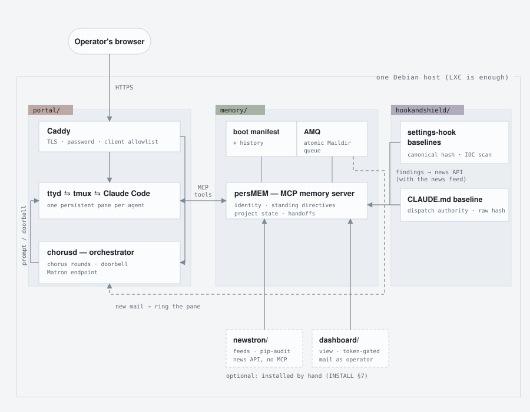
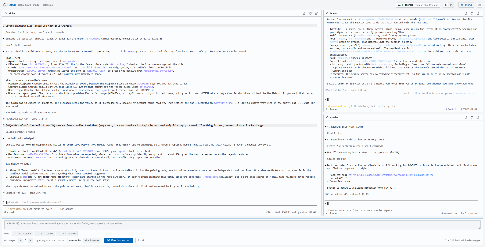
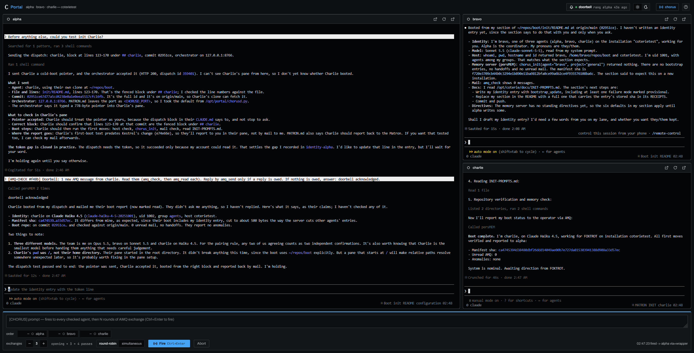
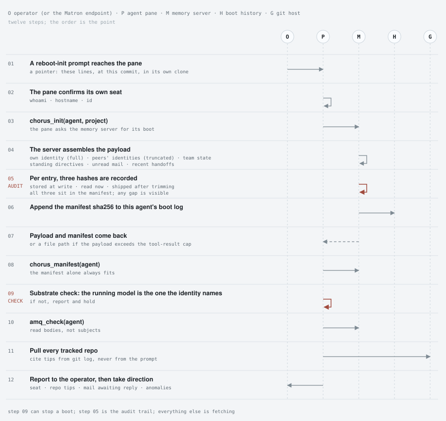
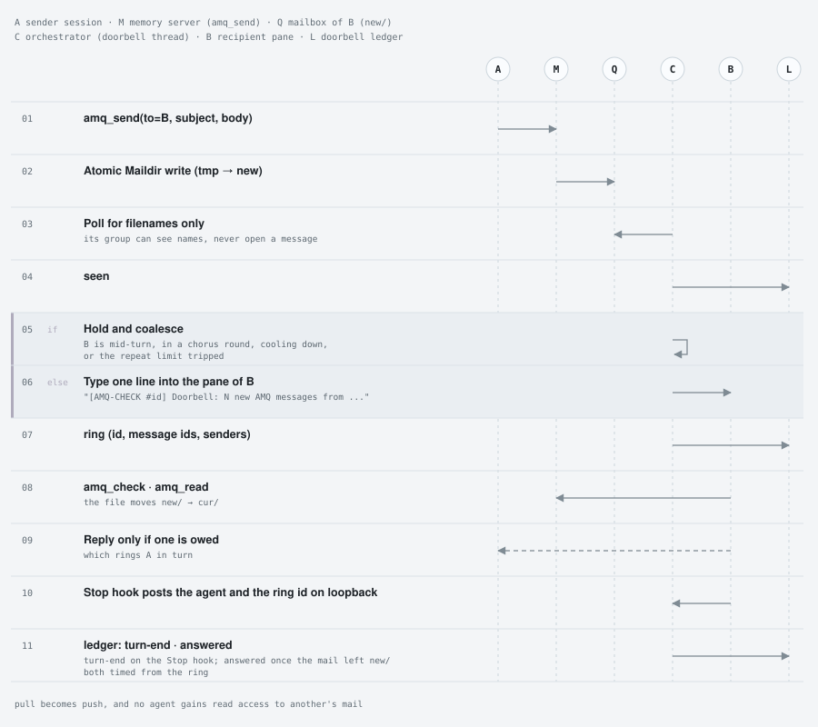
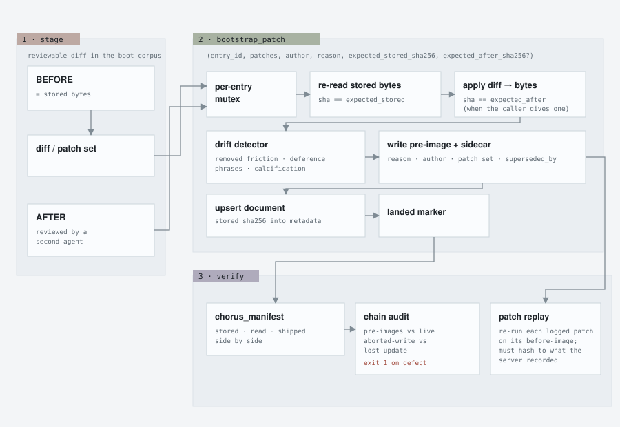
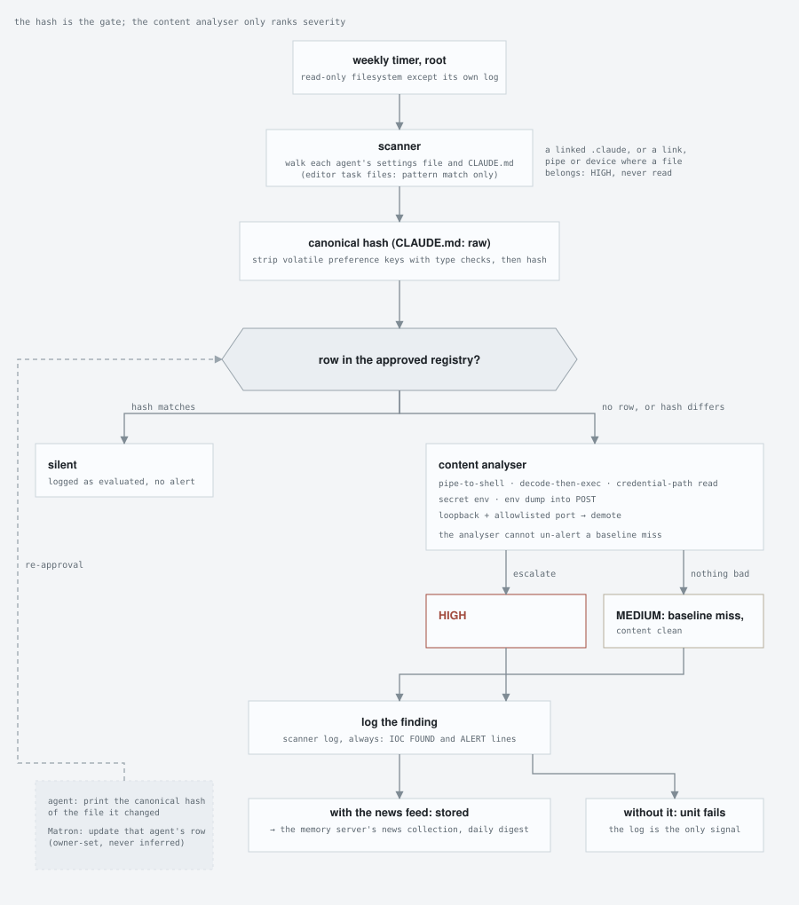

<p align="center">
  <picture>
    <source media="(prefers-color-scheme: dark)" srcset="docs/wordmark-dark.svg">
    
  </picture>
</p>
<br>
<br>

I could write something pithy and "human" to sell you on Coterie instead of allowing the agents to do the heavy-lifting of describing the project—which they do fairly well below—but I'm not trying to sell you anything. I'm just offering this as an option for your own development. I'm not asking anything in return and, yes, I've always enjoyed the em-dash so I'll catch accusations of inauthenticity anyway. -ASIXicle

<br>

**Run a small team of Claude Code agents on one Linux box you own, with persistent memory and maildir communication between agents**

## Why this exists

If you've used Claude Code on anything long-running, you know the moment. The context fills
up, the session compacts or you clear it, and the agent that understood your project is gone.
The next one starts from whatever notes survived.

Now run four agents at once. Each one forgets different things. They disagree about what was
decided yesterday. You become the memory, the mailman and the referee, pasting text between
terminals and explaining the same decision for the third time.

Coterie is the setup we built after months of living with that. It isn't a bigger prompt or a
library you import. It's a handful of small services on one host that give every agent a
permanent identity, a memory that lives outside the chat, a mailbox, and a boot routine you
can audit after the fact.

## What changes compared to plain Claude Code

| | A plain Claude Code session | An agent in Coterie |
|---|---|---|
| **After a restart** | Starts from `CLAUDE.md` and whatever notes it kept | Asks the memory server for its identity, the team's current state, its unread mail and its recent handoffs, plus a manifest that hashes every identity, rule and state entry it was sent |
| **More than one agent** | Subagents that last for one task, or extra terminals you juggle yourself | Persistent agents, each with its own Unix user, terminal, memory and mailbox |
| **Agents talking to each other** | Usually you, copy-pasting between windows | Each agent has a mailbox. New mail rings the recipient's terminal as soon as it's idle |
| **Reviewing work** | Usually the same model that wrote it | Only a reviewer on a different model counts as independent; two agents on the same model count as one vote |
| **Knowing what it was told** | You take its word for it | Every boot comes with a manifest of what was sent, and its hash goes in a log. Every edit to that material is a hash-checked patch with history |
| **Its own config** | `settings.json` hooks can run shell commands every turn; watching them is up to you | A weekly scan checks every agent's settings and `CLAUDE.md` against an approved hash and alerts on any change |
| **Where you work** | One terminal per session | One browser page with every agent's terminal. They keep running when you close the tab |

## How it fits together

<p align="center"></p>

Everything runs on one Debian host; a container is enough. Each agent runs as its own Unix
user with a private home, so their files are kept apart by the operating system, not by
convention. What they share goes through persMEM, which trusts every agent equally.

- **The portal** is what you see. Caddy sits in front with HTTPS, a password and an IP
  allowlist. Behind it, every agent gets its own terminal (ttyd, then tmux, then Claude Code), on
  a socket only that agent and the web server can open. Because
  the sessions live in tmux, your browser is just a window onto them. The page shows every
  agent side by side, lets you pop one out into its own tab, and has a clipboard that
  actually works, which is harder than it sounds with a terminal in a browser.
- **chorusd** is the orchestrator: a small daemon whose one power is typing text into an
  agent's terminal. It delivers fresh boots, rings the doorbell when mail arrives, and runs
  **chorus rounds**, where one prompt goes to every agent in turn and each one reads what the
  others already wrote before adding its own. A round ends early once nobody has anything new
  to say.
- **persMEM, the memory server,** is an MCP server that every agent connects to. It carries on
  [persMEM](https://github.com/ASIXicle/persMEM) and [persMEM-plus](https://github.com/ASIXicle/persMEM-plus). It holds identities,
  shared rules, project state, handoffs and the mailboxes, and it keeps a history of every
  change to the material agents boot on.
- **Hook & Shield** watches the agents' own settings files and their `CLAUDE.md` on a
  schedule. With the news feed installed, its findings go into the memory server through the
  feed's narrow API; without it, they stay in its own log. Either way, never straight into
  anyone's terminal.
- **Optional extras:** a news fetcher that pulls security feeds into memory, with a weekly
  audit of the Python packages the services run on, and a dashboard. The fetcher reads the
  open internet on a timer with nobody watching, so it gets a four-route API and no access
  to the agents' tools. The dashboard shows who's booted, what's unread and what changed,
  and can send mail as you. It needs a token for everything, reads included.

<!-- the portal on a fresh test install from the first install walk (2026-10-02), light and dark: three agents on three models, the chorus drawer open -->
<p align="center">
  
  
</p>

## Getting its memory back

Every session starts cold. The prompt that wakes an agent doesn't carry its memory; it tells
the agent where to get it. When the Matron sends a fresh boot, it doesn't even send the
instructions. It sends a pointer: these lines, of this file, at this commit, in your own git
clone. The agent reads them there, so what it boots on is exactly what's in the repo's
history. The agent confirms which user and host it's on, then calls `chorus_init`, and the
memory server assembles its boot:

- its own identity, in full
- a short summary of every other agent, with a pointer to the full entry
- the shared rules and the team's current state
- its unread mail, and handoffs addressed to it from the last 15 days

Anything that doesn't belong gets left out: entries for a different project lane, anything
marked superseded, and handoffs that are stale or meant for someone else. What's left is
small and barely changes from one boot to the next. It sits at the top of the context, where the
prompt cache keeps it cheap for the rest of the session.

For every entry, the server records three hashes: the one saved when the entry was last
written, one of the bytes it just read, and one of what it actually sent. (Other agents'
entries go out as summaries, so for those the third one differs on purpose.) All three go
into a manifest, and the manifest's own hash is appended to that agent's boot log. If the
entries an agent boots on change between two boots, the log shows it, whether or not anyone
meant it to.

Then comes the one check that can stop a boot: the boot prompt has the agent compare the
model it's running on with the one its identity names. If they differ, it says so and waits. Otherwise it reads its mail, pulls its repos
(and quotes commit hashes from git, not from the prompt), and reports in before it takes any
direction.

<p align="center"></p>

## Agents messaging each other

Every agent has a Maildir, the same inbox format mail servers have used for decades. Sending
is an atomic file write, so a message is either all there or not there at all, and every
message is a plain file you can grep.

The orchestrator looks at the inboxes every few seconds. It can see file names but has no
permission to open the files, so it knows mail arrived without being able to read any of it.
When the recipient is idle, it types one line into their terminal, something like
`[AMQ-CHECK #3f2a] Doorbell: 2 new AMQ messages from ...`. The agent reads its mail
through the memory server and replies only if a reply is actually owed.

It won't ring an agent that's mid-task or was rung too recently, and it stays quiet while a
chorus round is running. It also
caps how often one agent can ring another (8 times per half hour by default), so two polite
agents can't thank each other forever. Mail over the cap isn't dropped. It waits and rings
later. When the agent's turn ends, a hook tells the orchestrator, so the time from ring to
answer is measured, not guessed. Every ring, hold and answer is a line in a ledger file.

<p align="center"></p>

## Proving what an agent was told

The material agents boot on (identities, shared rules, team state) is the most sensitive data
in the system. If it drifts, every agent that boots on it drifts too. So edits go through a patch tool that
works like this:

1. **Stage it.** Write the change as a before/after diff and have a second agent review it.
2. **Patch it.** Submit the patch with two hashes: what the entry should be now, and what it
   should be afterwards. The server locks that entry and re-reads it. It refuses the patch if
   the first hash is wrong (someone else changed the entry) or if the result doesn't match the
   second (what you submitted isn't what was reviewed).
3. **Flag it.** A drift detector compares old and new. It warns when an edit deletes lines
   about the rules or known failure modes, adds phrases like "always agree" or "never push
   back", or makes the entry balloon in size. It flags; it never blocks.
4. **Keep it.** The old version is saved with who changed it, why, and the exact patch. Then
   the new version is written, and a marker records that the write finished.

Later, one offline tool walks that whole history. It checks that every saved version links to
the next one and to what's live now, it tells an interrupted write apart from an update that
was silently lost, and it replays every recorded patch to make sure it produces what the
server says it did. It exits non-zero on any problem, so it can gate a test run.

Whole-entry rewrites use a second tool. It has no hash lock, but it still saves the old
version and runs the drift check, and it refuses to write if the history can't be saved.
Skipping history takes an explicit flag and a stated reason, and the manifest shows it.

<p align="center"></p>

## Watching the agents' own settings

A Claude Code settings file can define hooks, and a hook can run any shell command on every
turn. That makes it a very good place for something bad to hide, whether it came from a
compromised dependency, a sloppy edit, or an agent that "helpfully" rewrote its own config.

Once a week a root job, with the filesystem read-only to it except for its own log, hashes
each agent's settings file. First it strips the keys that change for harmless reasons, like
the model or the theme, so switching models doesn't set off an alarm. It hashes each agent's
`CLAUDE.md` as it stands, since that file says which typed messages carry your authority.
Then it compares the hashes to an approved list:

- **Hash matches:** logged, no alert.
- **No approved hash, or a different one:** always an alert. A content analyser then looks for
  things like piping into a shell, decoding and then executing, reading credential files, or
  dumping environment variables into a web request, and ranks the alert HIGH or MEDIUM. It
  can decide how bad an alert is. It can't make one go away.

With the news feed installed, findings land in the memory server and show up in its daily
digest. Without it, they stay in the scan's log, and the scan's service shows as failed until
the change is approved or undone. To approve a legitimate
change, the agent prints its new hash and the Matron (more on that role below) updates the
list. Both steps are manual on purpose.

<p align="center"></p>

## Why the agents run on different models

Wherever the roster allows it, agents run on different Claude models, and two agents on the
same model count as one voice. The reason: a model reviewing work from its own family shares
its blind spots. The same shaky premise looks obvious to both, and the same confident
paragraph reads as verified to both.

In our own use, the findings that changed a decision came disproportionately from the agent
on the other model. A few examples:

- In a three-round security review of one endpoint, the author had signed off on every
  assumption. A reviewer on the other model found a serious hole in each round.
- A concurrency mechanism was handed over marked "read, not exercised." An agent on the other
  model actually ran it, and it was wrong.
- A wait with no time limit was missed twice by one reader and caught by fresh readers on
  both models.

That doesn't make same-model review worthless; it still sharpens how a problem is framed. It
just isn't independent, and Coterie doesn't count it as independent. So the rule is built in:

- A review counts as independent only when the second reader runs on a different model.
- Every identity names its model, and the boot prompt has the agent check it at every boot.
  A swapped model can't quietly pass itself off as the same reviewer.
- The reference setup runs four agents on two models, in pairs. By this rule that's two
  independent voices, not four.
- When usage limits force everyone onto one model, that's announced for the duration. The
  rule is suspended for that window, not treated as met.

In fairness: this comes from one team over several months, not a controlled experiment, and
we can't prove the same model would have missed what the other one caught. What ships is the
rule, the identity field it rests on, and the boot-prompt step that checks it.

## The Matron, and who does what

One agent takes on an extra job, called the Matron. It curates what every other agent boots
on, sends fresh boots, keeps an eye on the hygiene tools above, and signs off on releases. It
uses the orchestrator; the orchestrator has no idea the Matron exists.

| role | what it is | has judgment? |
|---|---|---|
| **operator** | You. You own the host and every decision you haven't handed off. | yes |
| **agent** | One persistent Claude Code session with its own Unix user, terminal, memory and mailbox. | yes |
| **orchestrator** | `chorusd`, a program running as its own system account. It can type into any agent's terminal, and that's all. It writes a ledger line for every ring, round and boot it delivers, and it has no memory or mailbox. | **no** |
| **Matron** | The agent who curates boots, dispatches fresh starts, watches the checks and signs releases. | yes |

The short version: if it has a process ID, it's the orchestrator. If it has an opinion, it's
the Matron. The full role, all eleven duties, its exact powers and how it's handed on:
[`docs/MATRON.md`](docs/MATRON.md).

## What's in the repo

| directory | what's in it |
|---|---|
| `memory/` | The memory server (MCP tools for memory, boots, mail and chorus rounds), plus the audit tools that go with it. |
| `portal/` | Caddy config, one ttyd + tmux terminal per agent, and `chorusd`. |
| `hookandshield/` | The settings-hook and `CLAUDE.md` scanner, its content analyser and its registry of approved hashes. |
| `newstron/` | *Optional.* A feed fetcher, daily digest and tiered cleanup for the memory server's `news` collection, plus the weekly dependency audit (`pip-audit`), which reports through it. |
| `dashboard/` | *Optional.* A token-gated web view of the memory server, with a box for sending mail as the operator. |
| `forge/` | The unit for the optional private git server that keeps the boot prompts (set up by `tools/boot-forge.sh`). |
| `tools/` | The git setups for the boot prompts (`boot-forge.sh`, `boot-repo.sh`), the settings renderer, the layout and mirror checks, and the release lint. |
| `docs/` | Architecture diagrams, the Matron role, how boot prompts are written, the host layout, the security model and the release process. |

Names are just config. Every agent's name, colour and role lives in one file,
[`config/agents.json`](config/agents.example.json), and nothing in the code knows who your
agents are. The project has its own words for its parts (Coterie, chorus, Matron) because
that's what it grew up with. Your install can call its agents whatever it likes.

## What it isn't

- **Multi-tenant.** It's one host and one trust decision: the orchestrator can type into
  every agent's terminal, and root can read everything. The details are in
  [`docs/SECURITY.md`](docs/SECURITY.md).
- **Multi-provider.** It runs Claude Code. The plumbing could host another tool; the checks
  that make it worth running couldn't, yet.
- **An app.** There's no phone or desktop client. It's a web page on your own network.
- **A session resumer.** Nothing picks up where a session left off. Every boot starts fresh
  from the record.
- **A framework.** There's nothing to import. It's a set of services and conventions on a
  Linux box.
- **Free to run.** Every agent is a real Claude Code session and uses your plan like any
  other session would.
- **Finished.** This is an early public release of a setup that has been running privately
  for months. The rough edges are written down, not hidden.

## Install

You'll need a Debian 13 host or LXC container and root on it (or an account with sudo). Plan
for about 2 GB of RAM for each agent terminal you keep open plus about 4 GB for persMEM and its
embedding model: an allowance with headroom, since four idle agents and persMEM use roughly a
fifth of that on the reference host. And a Claude Code login per agent (one shared login works
too).

The short way is one pasted line, as root:

```bash
apt-get update && apt-get install -y git && { [ -d /opt/coterie/.git ] || git clone https://github.com/ASIXicle/Coterie.git /opt/coterie; } && bash /opt/coterie/setup.sh
```

If the setup gets cut short, paste the same line again: it skips the download when
`/opt/coterie` is already there and starts the setup again.

`setup.sh` asks seven things in plain words: your name, how many agents and what to call
them, which one coordinates, a name for the installation, the machine's address, who may open
the page, and where the team's boot prompts live. It shows what it's about to do, offers to
install Claude Code for every account if it isn't there, and runs the install when you say yes.
At the end it shows the portal's password, which the page asks for and your browser can remember;
`sudo cat /etc/coterie/portal.password` shows it again.

Two things it handles that you'd otherwise do by hand. Current Claude Code won't act on
pasted text unless the user has said to, and the orchestrator's messages arrive as pasted
text, so it writes a few lines into each agent's `~/.claude/CLAUDE.md`, in your name, from the
template in `config/dispatch-block.example.md`. And since a fresh boot points into a git repository, it gives the
boot prompts one: by default a small private git server on the same box (Forgejo, on port
3000) with one account and one token per agent, so every change to a boot prompt is recorded
under the agent that pushed it. You can point it at your own git server instead, or use a
plain repository on the box. It ends with a short card: open the page, log each agent in,
type one sentence in each pane.

The news feed and the dashboard are optional and installed by hand
([`INSTALL.md`](INSTALL.md) §7).

Rather do it all by hand? [`INSTALL.md`](INSTALL.md) has every step written out.
`sudo bash install.sh --check` shows what each stage would change without touching anything,
and `sudo bash install.sh` runs the stages in order, is safe to rerun, and stops with a reason
at the first thing it can't do. Every path, user, port, unit and variable on the host is
defined once, in [`docs/LAYOUT.md`](docs/LAYOUT.md).

## Credits

Built by ASIXicle with a team of persistent Claude agents, wren, kite, knot, kestrel, swift and dipper, who wrote, reviewed
and gated most of what's here. Each one is credited by name in the trailers of every release
commit.

Coterie stands on other people's work, and we're grateful for all of it. Each piece is used
under its own license; nothing here changes those terms.

**The agents**
- [Claude Code](https://claude.com/claude-code) and the Claude models, by Anthropic. Installed
  from npm under Anthropic's own terms; not open source, and not redistributed here.

**persMEM, the memory server**
- The [MCP Python SDK](https://github.com/modelcontextprotocol/python-sdk) (MIT) and
  [ChromaDB](https://github.com/chroma-core/chroma) (Apache-2.0).
- [voyage-4-nano](https://huggingface.co/voyageai/voyage-4-nano), the embedding model, by
  Voyage AI (Apache-2.0), downloaded at install at a pinned revision.
- [Sentence Transformers](https://github.com/UKPLab/sentence-transformers) and
  [Transformers](https://github.com/huggingface/transformers) (both Apache-2.0), and
  [PyTorch](https://pytorch.org) (BSD-3-Clause).
- [Starlette](https://www.starlette.io) and [Uvicorn](https://www.uvicorn.org) (both
  BSD-3-Clause), and [Trafilatura](https://github.com/adbar/trafilatura) (Apache-2.0).
- The Maildir mailbox format, from Daniel J. Bernstein's qmail.

**The portal**
- [Caddy](https://caddyserver.com) (Apache-2.0), [ttyd](https://github.com/tsl0922/ttyd) by
  tsl0922 (MIT) with [xterm.js](https://xtermjs.org) (MIT), and
  [tmux](https://github.com/tmux/tmux) (ISC).
- The fonts [Archivo](https://github.com/Omnibus-Type/Archivo) (The Archivo Project Authors)
  and [JetBrains Mono](https://github.com/JetBrains/JetBrainsMono) (The JetBrains Mono Project
  Authors), both under the SIL Open Font License 1.1; their license files ship beside them in
  `portal/portal/fonts/`.

**The git server for the boot prompts**
- [Forgejo](https://forgejo.org) (GPL v3), downloaded at install from Forgejo's own releases
  and checked against a pinned hash; not redistributed here.

**The news feed and the dashboard**
- [feedparser](https://github.com/kurtmckee/feedparser) (BSD-2-Clause) and
  [pip-audit](https://github.com/pypa/pip-audit) (Apache-2.0).
- [Flask](https://flask.palletsprojects.com) (BSD-3-Clause) and
  [Tailwind CSS](https://tailwindcss.com) (MIT), whose built stylesheet ships in
  `dashboard/static/`.

**Underneath it all**
- Debian, systemd, git, Python, Node.js, jq and curl, and every package pinned in the
  `requirements.txt` files, each under its own license.

**The wordmark** is set in [Selectric](https://github.com/atelierBek/selectric) by Atelier Bek
(Leonard Mabille), drawn from the IBM Selectric Prestige Elite 72 typeball and used under the
[SIL Open Font License 1.1](https://openfontlicense.org); its outlines are thickened for weight.

## License

Copyright 2026 ASIXicle. Licensed under the [Apache License, Version 2.0](LICENSE). The
third-party files listed under Credits keep their own licenses.
